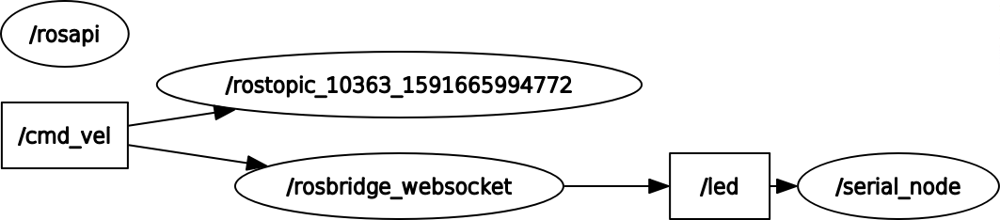

# MOMO Webpage
this webpage is created do that a user can send messages which will be displayed on the Neopixel Matirices on the sides of the MOMO bot.

## How it Works
<br>Figure 1.1</img>

Using the ROS-JS library, the webpage publishle messages users input intp the page to the "led" topic via rosbridge. The Rosserial node which is subscribed to this topic recieves it and sends it via I2C to the Arduino Uno that is connected directly to the Neopixel Matrix.

The code for the Arduino Unos can be found in my ROS Neopixel Matrix repository.

## Instructions
```
roscore
```
runs the ROS Master
<br>

```
rosrun rosserial_python serial_node.py
```
runs the rosserial python node
<br>

```
roslaunch rosbridge_server rosbridge_websocket.launch
```
runs rosbridge
<br>

```
roslaunch turtlebot3_gazebo turtlebot3_world.launch
```
launches the simulated turtlebot3_world on gazebo
<br>

```
roslaunch turtlebot3_gazebo turtlebot3_house.launch
```
another option for the type of "world" to launch. this on is in a "home" setting
<br>

```
rosrun robot_pose_publisher robot_pose_publisher
```
rosruns the robot_pose_publisher node to publish the robot's position to be displayed on the map

```
roslaunch turtlebot3_slam turtlebot3_slam.launch slam_methods:=gmapping
```
starts SLAM which maps the environent
<br>


```
roslaunch turtlebot3_gazebo turtlebot3_simulation.launch
```
This starts the autonomous navigation of the robot.
<br>

```
roslaunch turtlebot3_teleop turtlebot3_teleop_key.launch
```
Another option is to manually control the robot using the telop keys the robot by running the command below.
## Code

### HTML

Include the follwing libraries in the HTML file to use ROS WebTools and Plotly.js
````html
<script type="text/javascript" src = "plotly.min.js"></script>
<script type="text/javascript" src="http://static.robotwebtools.org/EventEmitter2/current/eventemitter2.min.js"></script>
<script type="text/javascript" src="http://static.robotwebtools.org/roslibjs/current/roslib.min.js"></script>
<script type="text/javascript" src="http://static.robotwebtools.org/EaselJS/current/easeljs.min.js"></script>
<script type="text/javascript" src="http://static.robotwebtools.org/EventEmitter2/current/eventemitter2.min.js"></script>
<script type="text/javascript" src="http://static.robotwebtools.org/roslibjs/current/roslib.min.js"></script>
<script type="text/javascript" src="http://static.robotwebtools.org/ros2djs/current/ros2d.min.js"></script>
````
### Javascript
<br>

```js
  var ros = new ROSLIB.Ros({
    url : 'ws://localhost:9090'
  });
```
This creates a new ROS node object that to communicate with the rosbridge.
<br>
Make sure your rosbridge is running on the same port.

<br/>
<br/>


```js
  ros.on('connection', function() {
    console.log('Connected to websocket server.');
  });

  ros.on('error', function(error) {
    console.log('Error connecting to websocket server: ', error);
  });

  ros.on('close', function() {
    console.log('Connection to websocket server closed.');
  });

```
* This adds 3 listeners to three different events an logs the corresponding text.

<br/>

```js
var led = new ROSLIB.Topic({
    ros : ros,
    name : '/led',
    messageType : 'std_msgs/String'
  });
```
* This creates a new ROS topic 'led' which we will publish string messages to. <br>
Make sure the name of this topic is consistent in the Rosserial node in the arduino code so that the publishing and subcribing on both ends will be successful.
<br>
<br>

```js
let sendButton = document.getElementById("submit");
  var text = ''

  sendButton.onclick = function(){
    text = document.getElementById("text").value;
    alert("Text in this box is: " + text);
    console.log(text);
    var newText = new ROSLIB.Message({
        data: text
     });

    led.publish(newText);
  }
```
* Sets the submit button on the webpage to a js variable.<br>
Create a listener that would output an alert as well as take the input message and create a ROS message with it.<br>
Publishes the newly created ROS message
<br>
<br>

```js
  var cmd_vel = new ROSLIB.Topic({
    ros: ros,
    name: '/cmd_vel',
    messageType: 'geometry_msgs/Twist'

  })
```

* Declares a new ROS Topic object "cmd_vel" which is published by the ROS Master


<br>

```js
  Plotly.plot("chart",[{
    y:[0],
    type:"line"
    }]);

  let run = true;
  function print_vel(msg){
          var currentTime=new Date();
           var hours=currentTime.getHours();
           var minutes=currentTime.getMinutes();
           var seconds=currentTime.getSeconds();
           var timeNow = hours+ ":" + minutes + ":"+ seconds ;
    console.log(timeNow);
    console.log(msg);
    let abs_vel = ((msg.linear.x)**2 + (msg.linear.y)**2+ (msg.linear.z)**2)**0.5;
    console.log(`The absolute velocity is ${abs_vel}`);
    let ang_vel = msg.angular.z;
    console.log(`The angular velocity is ${ang_vel}`);
    Plotly.extendTraces("chart",{y:[[abs_vel]]}, [0]);

   
  }
  cmd_vel.subscribe(function(msg){print_vel(msg)});
  ```
* Initiate the Plotly plot
* Initiate a function that would plot the euclidean velocity of the robot from the cmd_vel topic.
<br>
<br>

```js

var pose = new ROSLIB.Topic({
    ros : ros,
    name : '/robot_pose',
    messageType : 'geometry_msgs/Pose'
  });
  
  pose.subscribe(function(position){

    turtleBot.x = position.position.x;
    turtleBot.y = position.position.y;
  })
```
* Creates a new ROS Topic "robot pose"<br>
* Subcribes to the the topic
* Assigns the x & y position of the robot to the turtlebot object which,seen in the code below is the navigation arrow indicator on the ROS Map 

<br>

```js
  // Create the main viewer.
  var viewer = new ROS2D.Viewer({
    divID : 'map',
    width : 600,
    height : 500,
  });

  // Setup the map client.
  var gridClient = new ROS2D.OccupancyGridClient({
  ros : ros,
  rootObject : viewer.scene
});

 // adding the arrow pose of turtleBot to the map
 var turtleBot = new ROS2D.NavigationArrow({
  size:0.001,
  strokeSize: 0.1,
  pulse: true
})

  gridClient.rootObject.addChild(turtleBot) ;


  // Scale the canvas to fit to the map
  gridClient.on('change', function(){
    viewer.scaleToDimensions(gridClient.currentGrid.width, gridClient.currentGrid.height);
  });
```
* Creates the ROS Map with the live robot pose indcated with a navigation arrow


## Dependencies
Install the Turtlebot3 simulator> Instructions in the link below
>https://automaticaddison.com/how-to-launch-the-turtlebot3-simulation-with-ros/

<br><br/>
```
sudo apt-get install ros-<rosdistro>-robot-pose-publisher
```
install robot_pose package
<br>

```
sudo apt-get install ros-<rosdistro>-visualization
```
install rviz
<br>


```
sudo apt-get install ros-<rosdistro>-rosbridge-suite
```
install rosbridge
<br>

```
sudo apt install ros-<rosdistro>-slam-gmapping
```
install ros slam module